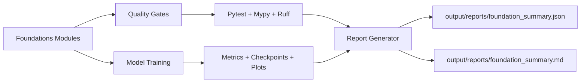
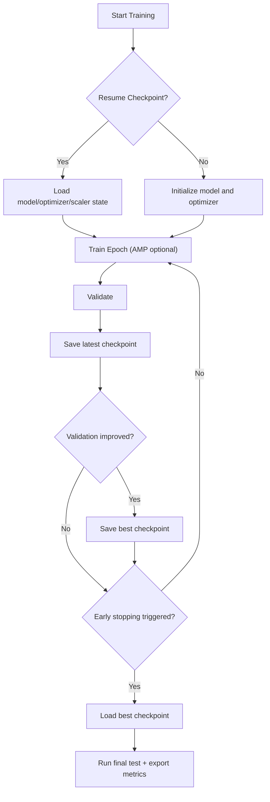

# ML Project 0 — Engineering-Grade Foundations

A resume-first ML foundations project that moves from "learning scripts" to a reproducible engineering baseline.

## 1. Problem Statement
Most beginner ML repos have one core weakness: they demonstrate concepts, but they do not demonstrate engineering reliability.

This project was upgraded to solve that gap.

Primary problem:
- Build a foundations repo that is interview-ready and engineering-grade, not a collection of disconnected experiments.

Success criteria:
- One standard quality baseline across the project (`pre-commit`, `ruff`, `mypy`, `pytest`)
- Reproducible reports with saved artifacts and real numbers
- Clear model baselines and metric comparisons
- Numerical stability practices explicitly implemented and tested
- Training lifecycle features used in real projects (early stopping, checkpoint/resume, profiling)

## 2. What Was Built
- Classical foundations in NumPy:
  - vectors, matrices, linear algebra, manual statistics, gradient descent intuition
- Deep learning foundations in PyTorch:
  - autograd-based gradient descent
  - MNIST MLP training + inference
  - synthetic time-series LSTM vs naive baseline
- Engineering layer:
  - quality gates (`ruff`, `mypy`, `pytest`, `pre-commit`)
  - benchmark (`NumPy vs PyTorch CPU`)
  - numerical stability module (log-sum-exp, overflow-safe softmax, gradient clipping)
  - report generator that saves test and performance artifacts

## 3. Architecture (Mermaid)




## 4. Technologies Evaluated and Selection Rationale
| Area | Options Tried | Final Choice | Why This Choice |
|---|---|---|---|
| Core numerical work | NumPy | NumPy | Fast, transparent, ideal for first-principles explanations. |
| DL training track | PyTorch + TensorFlow lab | PyTorch as primary, TensorFlow as comparison track | PyTorch gives direct control for educational training loops and engineering features. |
| Data scaling and metrics | Manual NumPy + `sklearn` utilities | Mixed (manual + sklearn) | Manual implementations explain the math; sklearn utilities improve practical reliability. |
| Quality and reliability | ad-hoc checks vs unified tooling | `pre-commit` + `ruff` + `mypy` + `pytest` | Standardized gates prevent regressions and improve signal in PR/review workflows. |
| Performance visibility | no instrumentation vs benchmark/profiler | Benchmark + optional profiler | Gives measurable speed/memory and training bottleneck visibility. |

## 5. Real Metrics (From Saved Artifacts)
Source files:
- `output/reports/foundation_summary.json`
- `src/output/mnist/mnist_training_metrics.json`
- `output/timeseries/lstm_predictions_vs_true.csv`

### 5.1 Quality Metrics
- Test suite: `39`
- Passed: `25`
- Skipped: `14`
- Failures: `0`
- Errors: `0`

Note:
- Skips are expected for optional stacks (e.g., environments without Torch/TF).

### 5.2 MNIST MLP Metrics
From `src/output/mnist/mnist_training_metrics.json` (5 epochs):
- Final train loss: `0.0496`
- Final train accuracy: `98.51%`
- Final validation loss: `0.0974`
- Final validation accuracy: `97.17%`

### 5.3 Time-Series Forecasting Metrics
From `output/timeseries/lstm_predictions_vs_true.csv`:
- LSTM MSE: `178.63`
- Naive last-value baseline MSE: `262.86`
- Absolute delta: `-84.23`
- Relative improvement vs baseline: `32.04%`

### 5.4 NumPy vs PyTorch CPU Benchmark
From `output/reports/benchmarks/numpy_vs_torch_cpu_benchmark.json` (current environment run):
- Backend: `numpy`
- Matrix size: `256 x 256`
- Repetitions: `8`
- Total time: `0.0002109 sec`
- Avg time/iter: `2.636e-05 sec`
- Peak RSS memory: `32.89 MB`

## 6. Challenges and How They Were Solved
### 6.1 Problem: "Educational scripts" were not maintainable
Solution:
- Added shared project tooling with explicit configs:
  - `pyproject.toml`
  - `.pre-commit-config.yaml`
  - `requirements-dev.txt`

### 6.2 Problem: Numeric overflow and unstable gradients
Solution:
- Implemented and tested:
  - stable log-sum-exp
  - stable softmax
  - gradient clipping for NumPy and PyTorch

### 6.3 Problem: Training runs were brittle after interruption
Solution:
- Added checkpoint lifecycle:
  - `latest` checkpoint per epoch
  - `best` checkpoint on validation improvement
  - resume support from checkpoint path

### 6.4 Problem: No reproducible evidence for README claims
Solution:
- Added deterministic report generation script:
  - `scripts/generate_foundation_report.py`
- Saved artifacts:
  - JUnit XML
  - benchmark outputs
  - numerical stability logs
  - machine-readable JSON summary

### 6.5 Problem: Repository growth could silently bypass tests
Solution:
- Added module inventory test to detect unaccounted source files:
  - `tests/test_module_inventory.py`

## 7. Project Structure
```text
0-foundations/
  ├─ src/
  │  ├─ numpy_basics.py
  │  ├─ linear_algebra_demo.py
  │  ├─ stats_basics.py
  │  ├─ gradient_descent_demo.py
  │  ├─ numpy_manual_stats.py
  │  ├─ numerical_stability.py
  │  ├─ benchmark_numpy_vs_torch_cpu.py
  │  ├─ torch_autograd_gd.py
  │  ├─ torch_mlp_mnist.py
  │  ├─ torch_mnist_inference.py
  │  ├─ torch_lstm_timeseries.py
  │  └─ tf_lab/
  ├─ tests/
  ├─ scripts/
  │  └─ generate_foundation_report.py
  ├─ docs/
  │  └─ numerical_stability.md
  ├─ output/
  │  ├─ mnist/
  │  ├─ timeseries/
  │  ├─ benchmarks/
  │  └─ reports/
  ├─ pyproject.toml
  ├─ .pre-commit-config.yaml
  ├─ requirements.txt
  └─ requirements-dev.txt
```

## 8. Reproducibility Commands
From `0-foundations/`:

```bash
python -m venv .venv
source .venv/bin/activate
pip install -r requirements-dev.txt
```

Run quality gates:

```bash
pre-commit run --all-files
ruff check .
mypy --config-file pyproject.toml src tests
python -m pytest -q tests
```

Generate report artifacts:

```bash
python scripts/generate_foundation_report.py
```

Train MNIST with engineering features:

```bash
python -m src.torch_mlp_mnist
python -m src.torch_mlp_mnist --resume-from models/mnist_mlp_latest.pt
python -m src.torch_mlp_mnist --profile --profile-steps 120
```

## 9. Resume-Ready Highlights
- Designed and implemented an engineering-grade ML foundations repository with unified lint/type/test gates and reproducible reporting.
- Implemented numerical stability safeguards (stable log-sum-exp, overflow-safe softmax, gradient clipping) with automated tests.
- Added training lifecycle reliability features (mixed precision, early stopping, checkpointing, resume, profiler traces).
- Built baseline-driven forecasting evaluation and quantified a `32.04%` MSE improvement over naive forecasting on synthetic time-series.
- Added deterministic artifact generation so README claims are backed by saved machine-readable outputs.

## 10. Notes
- `tf_lab/` is included as an optional comparative track.
- Some tests are intentionally skipped when optional dependencies are unavailable.
- Coverage reporting is enabled when `coverage` is available in the active Python environment.
