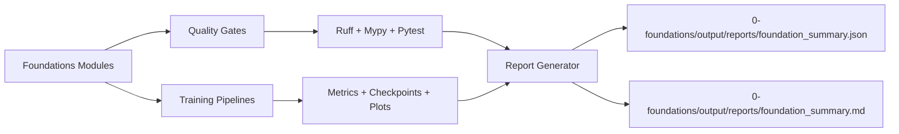
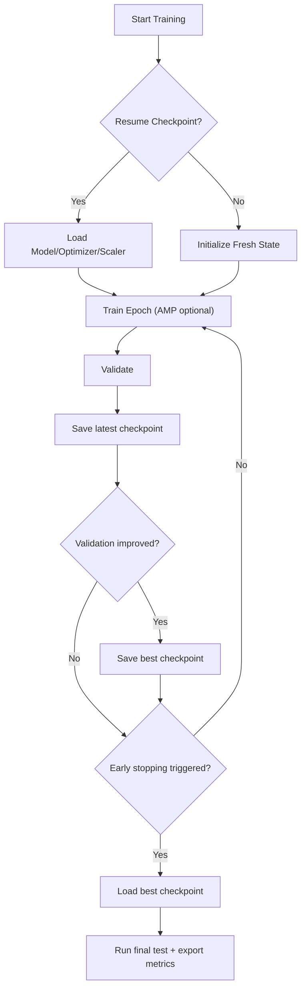

# 🧠 ML Project 0 – Python, Math & PyTorch Foundations

End-to-end **foundations for Machine Learning** in pure Python and PyTorch, written as small, focused scripts (no notebooks).

Goal: not just “run ML”, but **understand the building blocks** you will keep reusing in later projects, while keeping the codebase **engineering-grade** and interview-ready.

This repository keeps a single canonical README at the root. The spotlight project is `0-foundations`.

---

## 1. Problem Statement (Why This Exists)
Most beginner ML repositories have one core weakness: they demonstrate concepts, but not engineering reliability.

Primary problem:
- Build a foundations project that is both educational and production-minded, not a collection of disconnected scripts.

Success criteria:
- One standard quality baseline (`pre-commit`, `ruff`, `mypy`, `pytest`)
- Reproducible report artifacts with real metrics
- Clear baseline-first evaluation (not only model loss)
- Numerical stability practices implemented and tested
- Training lifecycle controls (mixed precision, early stopping, checkpoint/resume, profiling)

---

## 2. Tech Stack

**Languages & Core libs**
- Python 3.11+
- NumPy – vectors, matrices, manual stats, broadcasting
- Matplotlib / Seaborn – intuition-first plots

**Deep Learning**
- PyTorch – tensors, autograd, optimizers (SGD/Adam)
- Torchvision – MNIST dataset & transforms

**ML utilities**
- scikit-learn – scaling and metrics
- pandas – prediction/result exports

**Engineering**
- pre-commit
- ruff
- mypy
- pytest

No notebooks: everything is script-first to match real codebase workflows.

---

## 3. Architecture (Mermaid)




---

## 4. Project Structure

```text
0-foundations/
  ├─ src/
  │   ├─ numpy_basics.py
  │   ├─ linear_algebra_demo.py
  │   ├─ stats_basics.py
  │   ├─ gradient_descent_demo.py
  │   ├─ numpy_manual_stats.py
  │   ├─ numerical_stability.py
  │   ├─ benchmark_numpy_vs_torch_cpu.py
  │   ├─ torch_autograd_gd.py
  │   ├─ torch_mlp_mnist.py
  │   ├─ torch_mnist_inference.py
  │   ├─ save_mnist_sample.py
  │   ├─ torch_lstm_timeseries.py
  │   └─ tf_lab/
  │
  ├─ tests/
  ├─ scripts/
  │   └─ generate_foundation_report.py
  ├─ docs/
  │   └─ numerical_stability.md
  ├─ output/
  │   ├─ mnist/
  │   ├─ timeseries/
  │   ├─ benchmarks/
  │   └─ reports/
  ├─ models/
  ├─ pyproject.toml
  ├─ .pre-commit-config.yaml
  ├─ requirements.txt
  └─ requirements-dev.txt
```

> Note: large/binary artifacts (full datasets, checkpoints, generated outputs) are ignored by git.

---

## 5. Setup

From repository root:

```bash
cd 0-foundations
python -m venv .venv
source .venv/bin/activate        # Windows: .venv\Scripts\activate
pip install -r requirements-dev.txt
```

Run quality gates:

```bash
cd 0-foundations
pre-commit run --all-files
ruff check .
mypy --config-file pyproject.toml src tests
python -m pytest -q tests
```

Generate reproducible report artifacts:

```bash
cd 0-foundations
python scripts/generate_foundation_report.py
```

---

## 6. Classic Foundations (NumPy + Math)

These scripts are not toys; they build the mental model used later in sklearn/PyTorch pipelines.

### 6.1 `numpy_basics.py` – Arrays, dot, matmul, broadcasting
**Problem:** Build intuition for `ndarray` shapes and core linear operations.

Covers:
- 1D and 2D arrays
- shape/dtype inspection
- manual vs NumPy dot product
- matrix multiplication (`@`)
- transpose
- broadcasting rules

Run:
```bash
cd 0-foundations
python -m src.numpy_basics
```

### 6.2 `linear_algebra_demo.py` – Solving Ax=b, det, inverse, eigen
**Problem:** Understand linear systems and matrix transformations.

Covers:
- `np.linalg.solve`
- determinant and inverse
- eigenvalues/eigenvectors
- numerical check: `A @ v ≈ λv`

Run:
```bash
cd 0-foundations
python -m src.linear_algebra_demo
```

### 6.3 `stats_basics.py` – Descriptive stats + plots
**Problem:** Connect statistics to visual intuition.

Covers:
- synthetic normal-like data generation
- mean / variance / std
- covariance and correlation
- histograms and scatter plots

Run:
```bash
cd 0-foundations
python -m src.stats_basics
```

### 6.4 `gradient_descent_demo.py` – 1D gradient descent by hand
**Problem:** See optimization as iterative updates, not just formulas.

Objective:
- \( f(w) = (w - 3)^2 \)
- \( f'(w) = 2(w - 3) \)

Run:
```bash
cd 0-foundations
python -m src.gradient_descent_demo
```

### 6.5 `numpy_manual_stats.py` – Manual stats and standardization
**Problem:** Remove “magic” from `mean/var/std` and feature scaling.

Covers:
- `manual_mean`, `manual_variance`, `manual_std`
- `standardize_1d`
- `standardize_features` (column-wise)

Run:
```bash
cd 0-foundations
python -m src.numpy_manual_stats
```

Why it matters:
- You understand exactly what `StandardScaler` does and how leakage happens when train/test statistics are mixed.

---

## 7. Deep Learning Fundamentals (PyTorch)

### 7.1 `torch_autograd_gd.py` – Gradient descent with autograd + optim
**Problem:** Rebuild manual GD using PyTorch autograd mechanics.

Run:
```bash
cd 0-foundations
python -m src.torch_autograd_gd
```

### 7.2 `torch_mlp_mnist.py` – MLP on MNIST (engineering-grade)
**Problem:** Build a full training pipeline on a real dataset.

Core model:
- MLP: `784 -> [256, 128] -> 10`
- Loss: `CrossEntropyLoss`
- Optimizer: `Adam`

Engineering features added:
- mixed precision (AMP)
- early stopping
- checkpointing (`latest` + `best`)
- resume training
- optional PyTorch profiler traces

Run:
```bash
cd 0-foundations
python -m src.torch_mlp_mnist
python -m src.torch_mlp_mnist --resume-from models/mnist_mlp_latest.pt
python -m src.torch_mlp_mnist --profile --profile-steps 120
```

### 7.3 `torch_mnist_inference.py` – Single-image inference
**Problem:** Demonstrate clean inference path after training.

Run:
```bash
cd 0-foundations
python -m src.torch_mnist_inference --index 42
python -m src.torch_mnist_inference --image-path src/digit_42.png
```

### 7.4 `torch_lstm_timeseries.py` – LSTM vs naive baseline
**Problem:** Show sequence modeling with proper baseline and leakage-safe preprocessing.

Pipeline:
- synthetic series generation
- time-based split (no shuffle leakage)
- scaler fit on train only
- sliding windows
- LSTM forecast vs naive last-value baseline

Run:
```bash
cd 0-foundations
python -m src.torch_lstm_timeseries
```

---

## 8. Technologies Evaluated and Why
| Area | Options Tried | Final Choice | Why |
|---|---|---|---|
| Core numerics | NumPy | NumPy | Transparent, fast, and ideal for first-principles teaching. |
| DL track | PyTorch + TensorFlow lab | PyTorch primary, TensorFlow comparative | Better control for custom training loops and engineering add-ons. |
| Scaling/metrics | Manual NumPy + sklearn | Mixed | Manual for understanding, sklearn for reliability. |
| Quality | ad-hoc checks vs unified gates | pre-commit + ruff + mypy + pytest | Consistent guardrails and fewer silent regressions. |
| Perf visibility | none vs benchmark/profiler | benchmark + optional profiler | Objective runtime/memory and bottleneck visibility. |

---

## 9. Real Metrics (Saved Artifacts)
Source files:
- `0-foundations/output/reports/foundation_summary.json`
- `0-foundations/src/output/mnist/mnist_training_metrics.json`
- `0-foundations/output/timeseries/lstm_predictions_vs_true.csv`

Quality metrics:
- Test suite: `39`
- Passed: `25`
- Skipped: `14`
- Failures: `0`
- Errors: `0`

MNIST metrics (5 epochs snapshot):
- Final train loss: `0.0496`
- Final train accuracy: `98.51%`
- Final validation loss: `0.0974`
- Final validation accuracy: `97.17%`

Time-series metrics:
- LSTM MSE: `178.63`
- Naive baseline MSE: `262.86`
- Delta: `-84.23` (better)
- Relative improvement: `32.04%`

Benchmark snapshot (current environment):
- Backend: `numpy`
- Matrix size: `256 x 256`
- Repetitions: `8`
- Total time: `0.0002109 sec`
- Avg time/iter: `2.636e-05 sec`
- Peak RSS memory: `32.89 MB`

---

## 10. Challenges and Fixes
- Problem: educational scripts were hard to maintain.
- Fix: shared configs and unified quality gates.

- Problem: overflow and unstable gradients.
- Fix: stable log-sum-exp, stable softmax, gradient clipping + tests.

- Problem: brittle training after interruptions.
- Fix: checkpoint lifecycle and resume support.

- Problem: README claims lacked reproducible evidence.
- Fix: deterministic report generation and persisted artifacts.

- Problem: repository growth could bypass tests.
- Fix: module inventory checks.

---

## 11. Resume-Ready Highlights
- Built an engineering-grade ML foundations project with unified lint/type/test gates.
- Implemented numerical stability safeguards and validated them with automated tests.
- Added training lifecycle controls: AMP, early stopping, checkpointing, resume, profiler.
- Quantified baseline-driven forecasting gains (`32.04%` MSE improvement vs naive).
- Added reproducible reporting so claims are backed by machine-readable artifacts.

---

## 12. Notes
- `0-foundations/src/tf_lab` is an optional comparative TensorFlow track.
- Some tests are skipped when optional dependencies are unavailable.
- Coverage reporting works when `coverage` exists in the active Python environment.

---

## 13. License

```text
MIT License

Copyright (c) 2026 Mohammad Eslamnia
...
```
