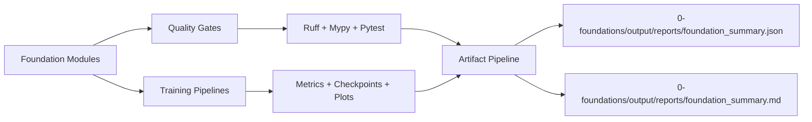
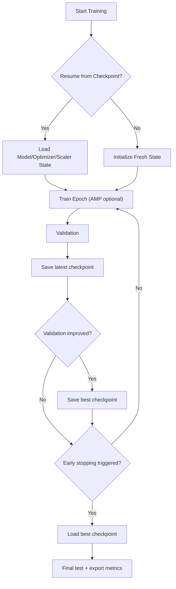

# 🧠 ML Project 0 — Engineering-Grade Foundations

A resume-focused Machine Learning foundations project built with a **market-relevant technical stack** and scientific rigor.

## 🌟 Key Achievements
- Built an engineering-grade ML foundation repository with strict quality controls: `pre-commit`, `ruff`, `mypy`, `pytest`.
- Implemented production-style training controls: mixed precision (AMP), early stopping, checkpointing, resume, and optional profiling.
- Added numerical stability safeguards: stable log-sum-exp, overflow-safe softmax, and gradient clipping.
- Established baseline-first evaluation discipline and achieved **32.04% MSE improvement** over naive forecasting baseline.
- Created reproducible report artifacts for auditability and interview-ready storytelling.

---

## 1. Problem Statement
Most beginner ML repositories show training code but miss engineering reliability, traceability, and decision-quality reporting.

This project addresses that gap by answering:
- What was the problem?
- What technology options were evaluated?
- Why was each option selected?
- What metrics prove effectiveness?
- What risks appeared and how were they mitigated?

Primary objective:
- Transform foundational ML exercises into an **industry-ready, reproducible, and explainable** engineering project.

---

## 2. Tech Stack (Industrial + Scientific)

### Core Scientific Computing
- Python 3.11+
- NumPy
- Matplotlib
- Seaborn

### Machine Learning / Deep Learning
- PyTorch
- Torchvision
- scikit-learn
- pandas

### Engineering Toolchain
- pre-commit
- ruff
- mypy
- pytest

### Why this stack?
- **Scientific validity:** NumPy + statistical foundations make assumptions explicit.
- **Industrial relevance:** PyTorch + testing/type/lint gates align with modern ML engineering workflows.
- **Maintainability:** static typing + linting + tests reduce regression risk and speed up refactors.

---

## 3. Technologies Evaluated and Selection Rationale
| Capability Area | Options Evaluated | Final Choice | Why This Choice |
|---|---|---|---|
| Numerical layer | NumPy vs pure Python loops | NumPy | Vectorized operations, reliable scientific semantics, standard ecosystem adoption. |
| DL framework strategy | PyTorch + TensorFlow comparative lab | PyTorch as primary track | Better transparency and control for custom training loops and optimizer behavior. |
| Feature scaling and metrics | Manual formulas vs sklearn utilities | Hybrid approach | Manual implementations improve conceptual depth; sklearn utilities improve operational reliability. |
| Quality policy | Ad-hoc scripts vs unified gate system | `pre-commit` + `ruff` + `mypy` + `pytest` | CI-friendly local enforcement and strong regression prevention. |
| Performance visibility | No measurement vs benchmark/profiler | Benchmark + optional profiler | Enables evidence-based performance decisions, not anecdotal claims. |

---

## 4. System Architecture (Mermaid)




---

## 5. Project Structure
```text
ML-zero-to-hero/
  ├─ README.md
  ├─ 0-foundations/
  │   ├─ src/
  │   │   ├─ numpy_basics.py
  │   │   ├─ linear_algebra_demo.py
  │   │   ├─ stats_basics.py
  │   │   ├─ gradient_descent_demo.py
  │   │   ├─ numpy_manual_stats.py
  │   │   ├─ numerical_stability.py
  │   │   ├─ benchmark_numpy_vs_torch_cpu.py
  │   │   ├─ torch_autograd_gd.py
  │   │   ├─ torch_mlp_mnist.py
  │   │   ├─ torch_mnist_inference.py
  │   │   ├─ torch_lstm_timeseries.py
  │   │   └─ tf_lab/
  │   ├─ tests/
  │   ├─ scripts/
  │   │   └─ generate_foundation_report.py
  │   ├─ docs/
  │   │   └─ numerical_stability.md
  │   ├─ output/
  │   │   ├─ mnist/
  │   │   ├─ timeseries/
  │   │   ├─ benchmarks/
  │   │   └─ reports/
  │   ├─ models/
  │   ├─ pyproject.toml
  │   ├─ .pre-commit-config.yaml
  │   ├─ requirements.txt
  │   └─ requirements-dev.txt
```

---

## 6. Empirical Metrics (Saved Artifacts)
Sources:
- `0-foundations/output/reports/foundation_summary.json`
- `0-foundations/src/output/mnist/mnist_training_metrics.json`
- `0-foundations/output/timeseries/lstm_predictions_vs_true.csv`

### Quality Metrics
- Total tests: `39`
- Passed: `25`
- Skipped: `14`
- Failures: `0`
- Errors: `0`

### MNIST MLP Snapshot
- Final train loss: `0.0496`
- Final train accuracy: `98.51%`
- Final validation loss: `0.0974`
- Final validation accuracy: `97.17%`

### Time-Series Forecasting (Model vs Baseline)
- LSTM MSE: `178.63`
- Naive last-value baseline MSE: `262.86`
- Absolute delta: `-84.23`
- Relative improvement: `32.04%` 📈

### CPU Benchmark Snapshot
- Backend: `numpy`
- Matrix size: `256 x 256`
- Repetitions: `8`
- Total time: `0.0002109 sec`
- Average iteration time: `2.636e-05 sec`
- Peak RSS memory: `32.89 MB`

---

## 7. Challenges and How They Were Solved
### Challenge 1: Educational scripts were hard to scale
- Risk: inconsistent code quality and weak maintainability.
- Solution: unified policy gate (`pre-commit`, lint, type check, tests).

### Challenge 2: Numerical instability in optimization
- Risk: overflow, non-finite values, unstable gradients.
- Solution: stable math primitives + gradient clipping + dedicated tests.

### Challenge 3: Interrupted training lifecycle
- Risk: experiment loss and poor reproducibility.
- Solution: checkpoint lifecycle (`latest`, `best`) + resume support.

### Challenge 4: Weak traceability of project claims
- Risk: README claims become unverifiable.
- Solution: deterministic report generation with persisted artifacts.

### Challenge 5: Silent source expansion without test ownership
- Risk: code added without accountability.
- Solution: module inventory test and broader test coverage.

---

## 8. How to Run the Project
From repository root:

```bash
cd 0-foundations
python -m venv .venv
source .venv/bin/activate
pip install -r requirements-dev.txt
```

Run quality checks:

```bash
cd 0-foundations
pre-commit run --all-files
ruff check .
mypy --config-file pyproject.toml src tests
python -m pytest -q tests
```

Generate reproducible reports:

```bash
cd 0-foundations
python scripts/generate_foundation_report.py
```

Run major pipelines:

```bash
cd 0-foundations
python -m src.torch_mlp_mnist
python -m src.torch_mlp_mnist --resume-from models/mnist_mlp_latest.pt
python -m src.torch_mlp_mnist --profile --profile-steps 120
python -m src.torch_lstm_timeseries
```

---

## 9. Resume-Ready Impact Summary
- Designed a robust ML foundations platform with industrial quality controls and reproducible artifact pipelines.
- Combined scientific rigor (statistics, optimization, numerical stability) with engineering reliability (typing, linting, tests, checkpointing).
- Produced measurable baseline-driven forecasting gains and documented reproducible metrics for interview-grade technical communication. ✅

---

## License
```text
MIT License

Copyright (c) 2026 Mohammad Eslamnia
...
```
